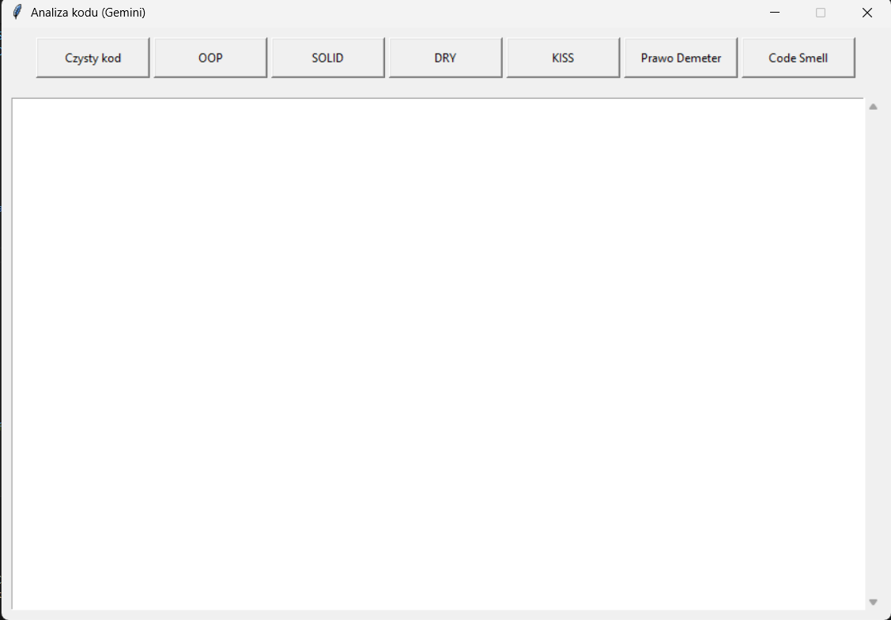
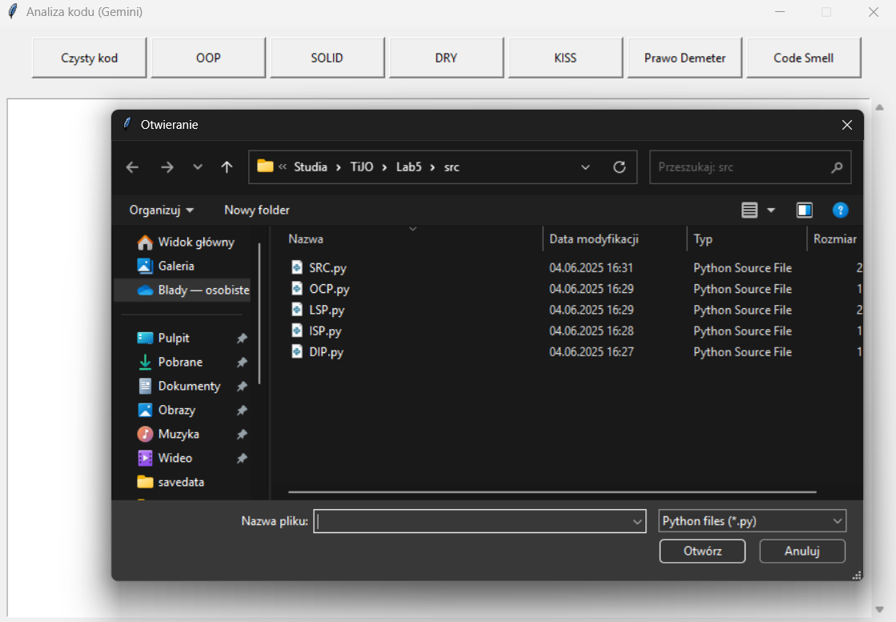
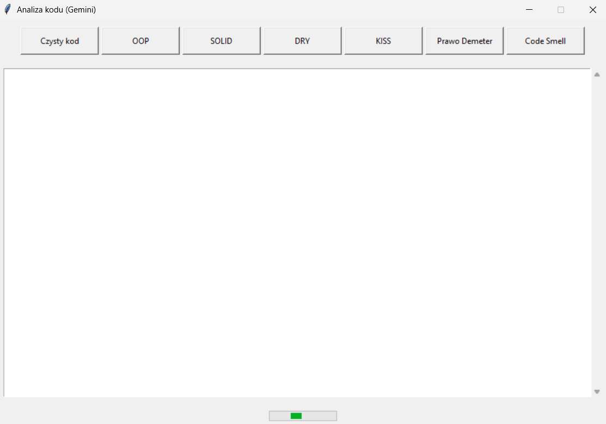
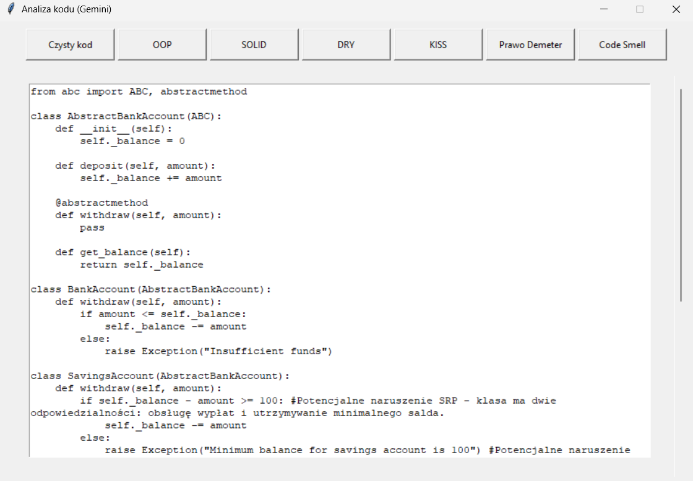

# Tytuł

Code Analizer

# Analiza Kodu (Gemini)

Aplikacja desktopowa oparta o **Google Gemini API**, która umożliwia automatyczną analizę kodu źródłowego w języku Python zgodnie z zasadami czystego kodu oraz dobrymi praktykami programistycznymi.






---

## Funkcjonalności

- Obsługa popularnych zasad takich jak:
  - Czysty Kod
  - OOP
  - SOLID
  - DRY
  - KISS
  - Prawo Demeter
  - Wykrywanie Code Smell
- Intuicyjny interfejs graficzny (`Tkinter`)
- Wsparcie dla plików `.py`
- Analiza oparta o **Google Gemini (1.5 Flash)**

---

## Wymagania

- Python 3.8+
- Konto i klucz API do [Google Gemini](https://ai.google.dev/)
- Pakiety:
  ```bash
  pip install google-generativeai


## Twórca

[GitHub](https://github.com/Dilo993)